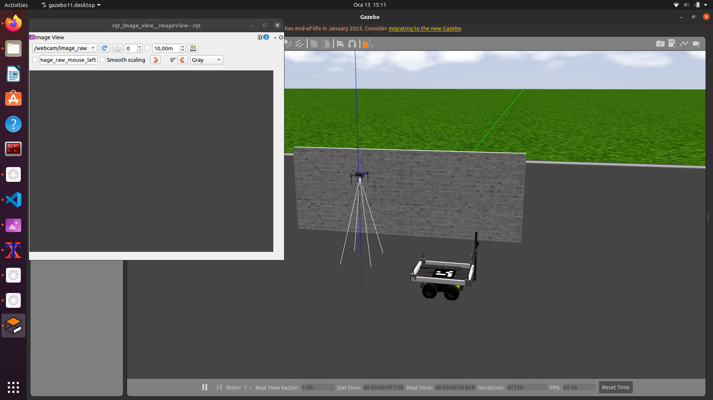
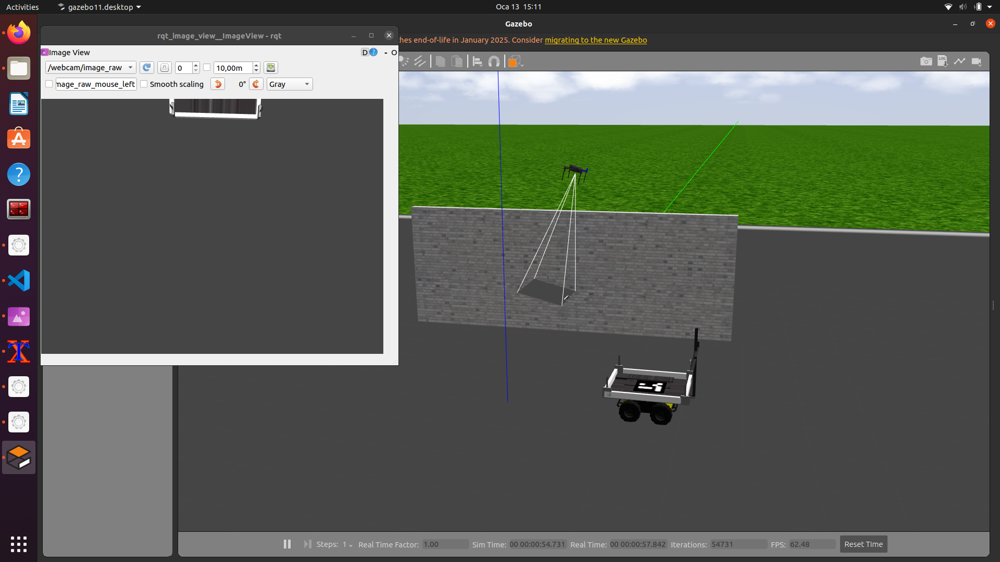
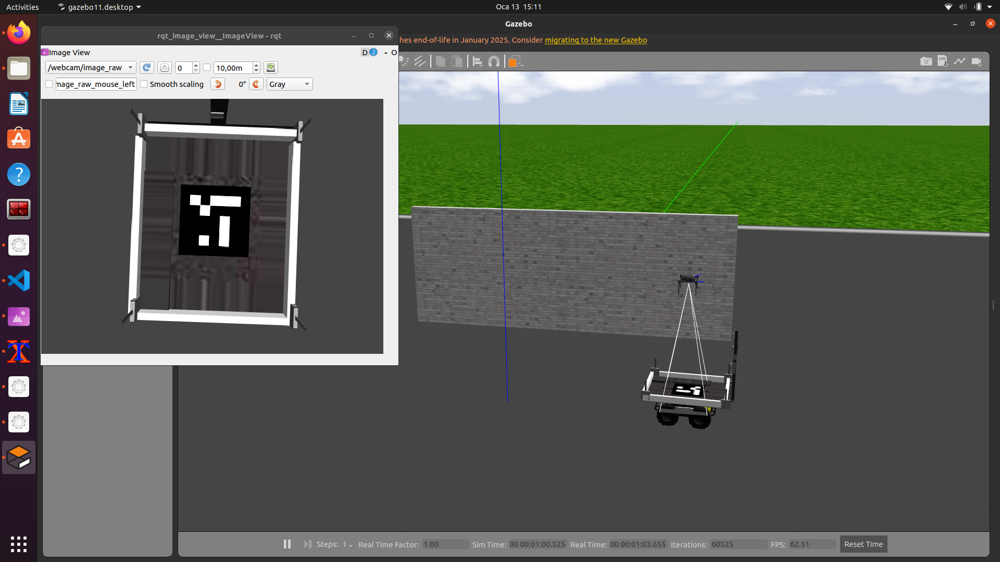
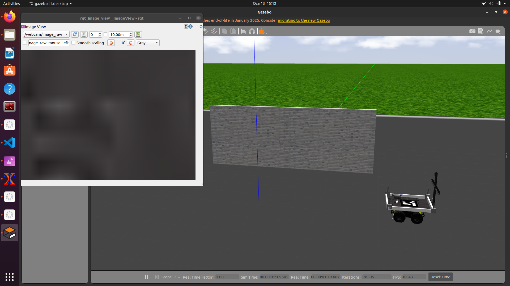

<div align="center">
  <h1 align="center">Moving Platform UAV Landing</h1>
</div>

<div style="text-align: justify;">
<p style="text-align: justify;">
  <strong> In this study, a low-cost, reliable, and high-accuracy solution is aimed to be developed using ArUco visual marker systems. The work examines the advantages and applicability of visual marker technology for autonomous UAV landings on moving platforms.Within the scope of the project, a structure based on the Ubuntu operating system and ROS (Robot Operating System) was established in the Gazebo simulation environment, and the UAV was controlled using the ArduPilot SITL software. </strong> 
</p>
  <p style="text-align: justify;">
  <strong>
ArUco markers were placed on the unmanned ground vehicle chosen as the moving platform, enabling the UAV to detect these markers and perform landings according to dynamic environmental conditions. Algorithms developed using the Python programming language along with the OpenCV, dronekit, and rospy libraries supported real-time detection of visual markers and the control of the landing process. The simulation results demonstrate that the system enables safe and precise landings on moving platforms while offering a low-cost and practical solution. The developed system provides an infrastructure that can increase operational efficiency, particularly in military operations and civil applications.
</strong> 
</p>
</div>

---
## 👉 📋 Dependencies & 🖥️ System Requirements
<table>
  <thead>
    <tr>
      <th>📦 Dependency</th>
      <th>🖥️ Version/Details</th>
    </tr>
  </thead>
  <tbody>
    <tr>
      <td>Ubuntu</td>
      <td>20.04 LTS</td>
    </tr>
    <tr>
      <td>ROS</td>
      <td>Noetic</td>
    </tr>
    <tr>
      <td>Gazebo</td>
      <td>11.x</td>
    </tr>
    <tr>
      <td>Ardupilot SITL</td>
      <td>Latest Supported</td>
    </tr>
  </tbody>
</table>

---

## 📦 Installation and Configuration

<h3>Step 1: Clone the Repository</h3>
<p>Clone this repository into the <strong>catkin workspace's <code>src</code> directory</strong> using the following command:</p>
<pre>
<code>git clone https://github.com/HarunEnsar/moving_platform_uav_landing.git</code>
</pre>
<h3>Step 2: Build the Workspace</h3>
<p>Navigate to the root of your catkin workspace and run the following command to build the workspace:</p>
<pre>
<code>catkin_make</code>
</pre>
<p>This will compile the packages in your workspace.</p>

## 🛠️ User Guide

<strong> Terminal 1: Launch the Project</strong>

```bash
roslaunch arkhe_gazebo drone.launch
```

<strong> Terminal 2: Launch ArduPilot SITL</strong>

```bash
cd ~/ardupilot/ArduCopter
../Tools/autotest/sim_vehicle.py -w gazebo-iris --console --map
```
## 📸 Project Screenshots

<div align="center">

<hr>

<hr>

<hr>

<hr>
</div>

## 🎉 Acknowledgments

This project was made possible by the following open-source tools and resources:

- [ArduPilot SITL](https://ardupilot.org/dev/docs/sitl-simulator-software-in-the-loop.html): The ArduPilot SITL Docs.
- [ArUco Markers](https://docs.opencv.org/4.x/d5/dae/tutorial_aruco_detection.html): Detection of ArUco Markers.
- [arucogen](https://chev.me/arucogen/): Online ArUco markers generator.

---

## 🔖 License

This project is licensed under the MIT License :
